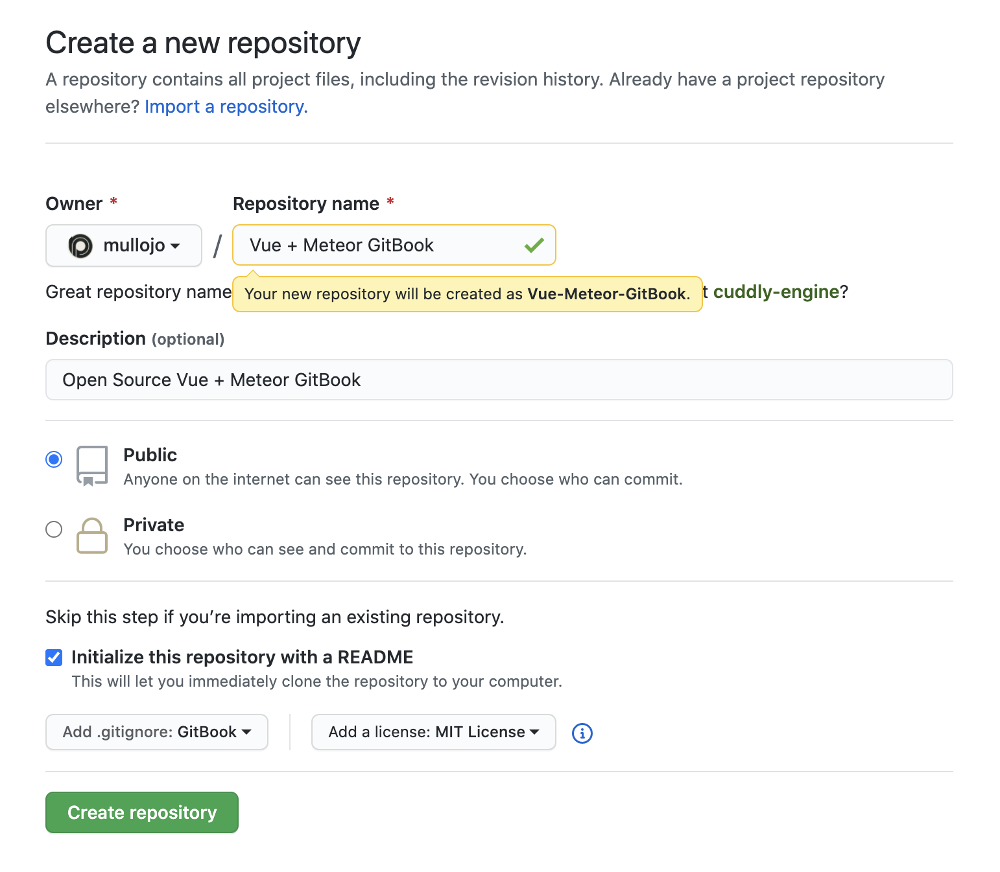

# Open Source Licenses

When you sync your GitBook with a newly created GitHub repository on your own GitHub account, you should select "Add a license" and select **MIT License**.

An **MIT License** is the most permission granting open source license and the same license used by Meteor.

We've been given free **open source** usage of GitBook for the Meteor project, so we're just asking that you do this one step, to be officially open source.

